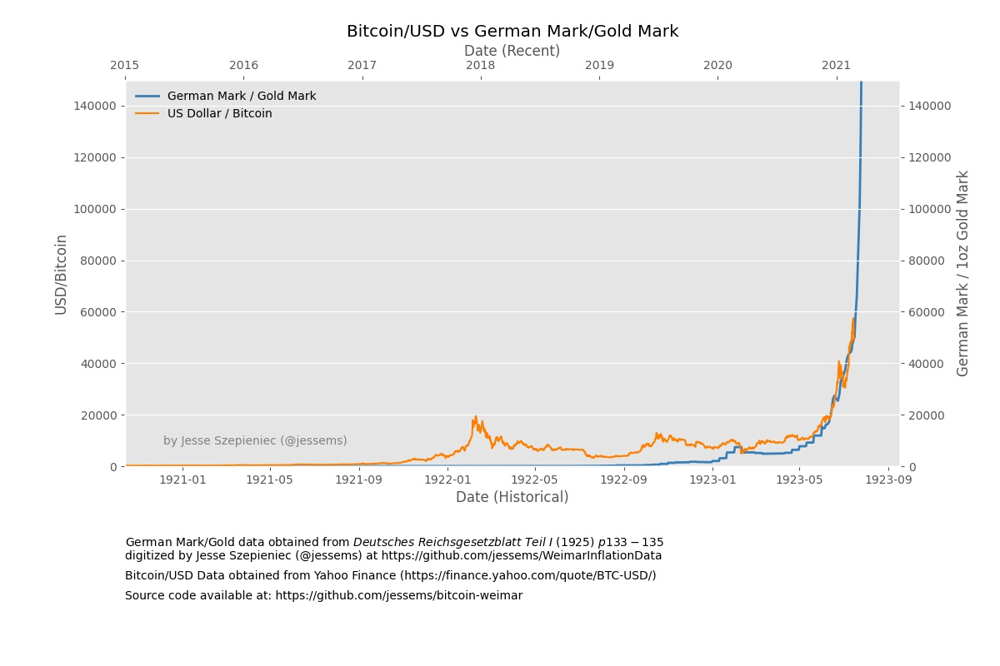

# Bitcoin-Weimar: A comparison of the USD/BTC ratio to the historic German Mark/Gold Mark ratio in the Weimar Republic

This repository pulls together data on the exchange rate between USD and Bitcoin (from Yahoo finance) and historical data on the exchange rate between the German Mark and the Gold Mark.

Note that the raw data found in the WeimarInflationData repository was digitized in an attempt to retain the original method of bookkeeping. As the inflation rate started to pick up speed, however, the exchange rates needed to be tabulated more frequently. Hence, the frequency keeps increasing until it becomes daily. Also, some individual dates have missing data. This IPython Notebook also contains a script to conver the data into a neat and usable format including an interpolation of the missing data.

## Sources

1. USD/BTC data: [https://finance.yahoo.com/quote/BTC-USD/](https://finance.yahoo.com/quote/BTC-USD/)
2. German Mark / Gold Mark data: [https://github.com/jessems/WeimarInflationData](https://github.com/jessems/WeimarInflationData)
3. I first got this idea when I saw this tweet: https://twitter.com/100trillionUSD/status/1360154022565535746

